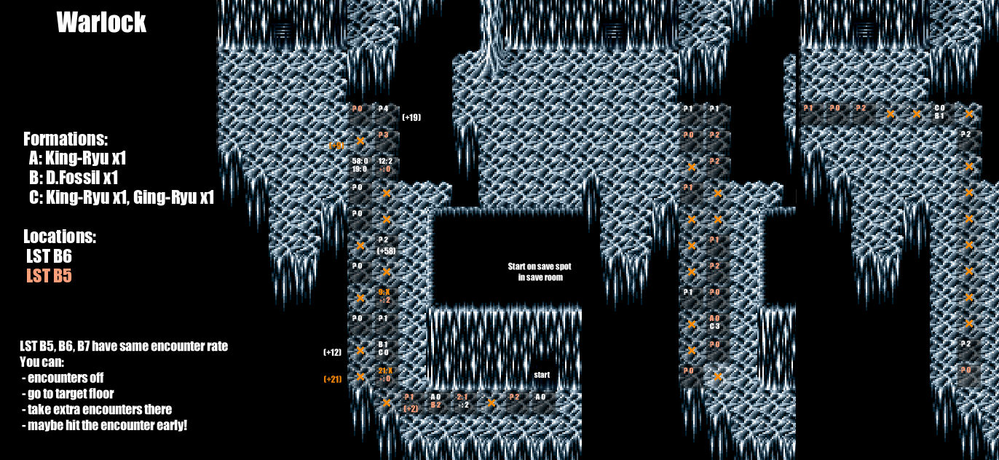

## Examples
Note: This project is a WIP. Use these step charts in actual races at your own risk, especially if you haven't tested them in a practice seed first!
Charts marked with a ✔ I have used a few times in a practice seed.

**If you want charts that require no step-counting at all, see the [formations-only charts](./formations-only/)**

### Baron

D Machin

Mac Giant

### Mysidia

D Machin

Mac Giant ✔

### Lunar Surface

Mac Giant ✔

Warlock ✔

m

King-Ryu

### Lunar B7 (Save point start)

Warlock ✔

## Usage
These examples are loops that can be walked
 - Encounters on, stand on "start"
 - Save + Reset
 - Start walking the route / loop. The cell at the start of each loop cell is a bit lighter to make it easier to look up quickly.
 - When you get an encounter, look at what cell (and what loop) you are in. The routes are plotted so you can use nearby terrain features to do this.
   - If the cell is an `X` reset
   - If the cell is `? <NUMBER>`:
     - Your fight will be after `<NUMBER>` additional encounters here.
   - If the cell is `<LETTERS> <NUMBER>` - e.g. `A 3`, `AB 0`:
     - Look at the relevant encounter formations for these letters. If this is the encounter you see, your fight will be after `<NUMBER>` additional encounters.
   - If the cell is `<NUMBER/*>: <NUMBER/X>` - e.g. `42: 1` `*: X`:
     - If the first `NUMBER` is a `*` that means any other step count
     - If the second `NUMBER` is a `X` that means reset for this step count
     - Start counting steps after the first encounter. If your step count is the first number then your encounters will be after `<NUMBER>` additional encounters
       - Note: this does not include the encounter you get while doing the step counting!
     - Example: `3: X`, `*: 2` in a cell would mean reset if the step count was 3, otherwise take 2 extra encounters after your counted encounter
     - On Some charts, there will be helper numbers next to cells (or in brackets - e.g. `(+9)`)
       - if you follow the main loop around this will indicate the end of the associated step count.
 - After running/winning the last encounter turn off encounters immediately and head to the location
 - Your goal encounter will be in the location with the color of the text in the box (if there are multiple locations)
