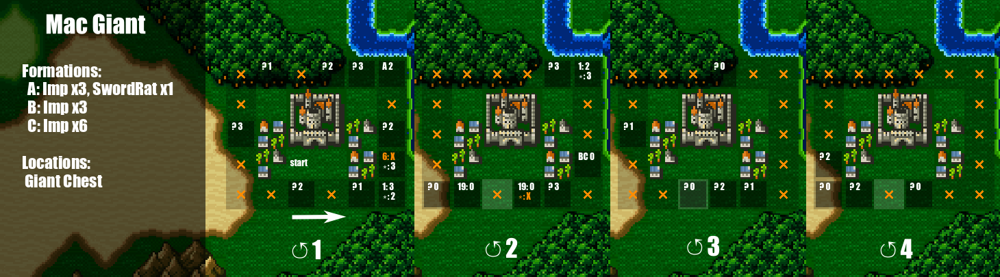
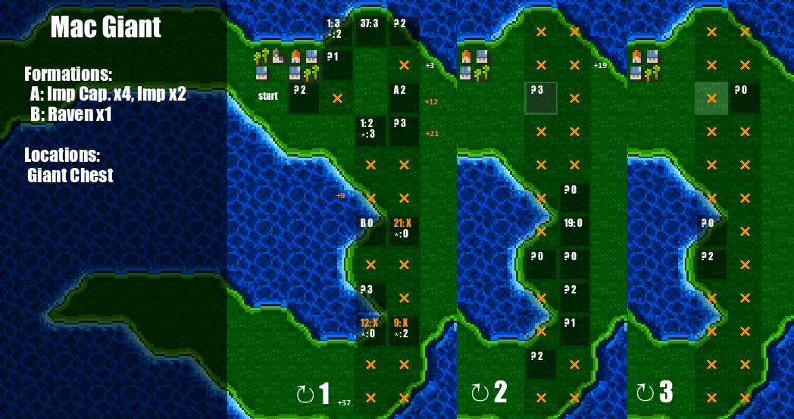

## Examples

Baron D Machin

Baron Mac Giant

Mysidia D Machin

Mysidia Mac Giant

Mysidia Reaction

Mysidia Warlock

Mysidia King-Ryu

## Usage
This project is a WIP. Use these step charts in actual races at your own risk!

These examples are loops that can be walked
 - Encounters on, stand on "start"
 - Save + Reset
 - Start walking the route / loop
 - When you get an encounter on a cell with an x, reset
 - When you get an encounter on a dark cell:
    - If the cell has a ?
      - Run from this encounter, and then an additional X times using the number after the ?
      - e.g. `? 2` would mean run from your initial encounter, then 2 more encounters. Your goal encounter will be on the next encounter.
    - If the call has some letters
        - If your encounter does not match one of the lettered encounters for this cell, reset
        - Take an additional X encounters using the number after the ?
    - Your goal encounter will be in location with the color of the text in the box.
    - After running from the last encounter turn off encounters immediately and head to the location

It is helpful to identify bits of nearby terrain to find your reference square quickly.